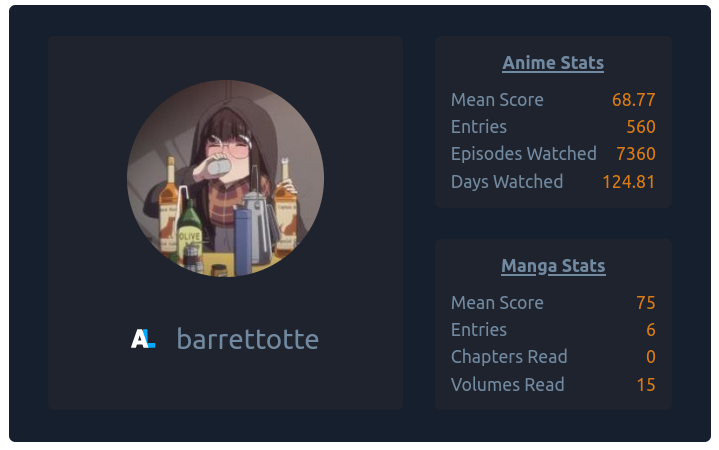

# anilist-stencil

Stencil.js component to display a public Anilist user.



Not a very good project, but I just wanted to play around with Stencil.js.
I kind of want to use this on my portfolio site so I'll probably come back later
and polish up the styling.

## Usage

```html
<anilist-user username="barrettotte"></anilist-user>
```

## References

- [Anilist Interactive GraphQL Tool](https://anilist.co/graphiql)
- [Stencil.js docs](https://stenciljs.com/docs/api)
